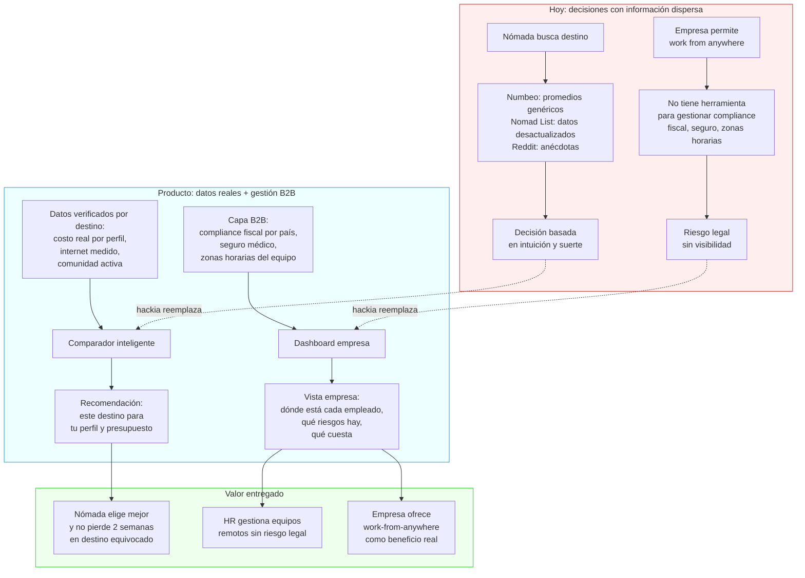
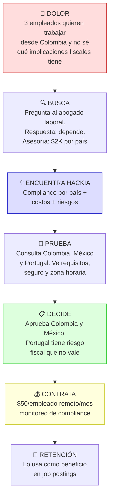

# Travel × Nomadismo: infraestructura de datos para nómadas digitales

> Hipótesis central: **El mercado de nómadas digitales y reubicación temporal no tiene infraestructura de datos consolidada.**

Contexto macro: [[espacio-de-oportunidad]] | Research de mercado: [[nomadas-digitales-research]]

---

## El problema

El nómada digital tiene que tomar decisiones complejas con información dispersa:
- Costo de vida real (no el promedio de Numbeo, sino el real para su perfil)
- Conectividad confiable (velocidad, cortes, opciones de backup)
- Comunidad y red social (¿hay otros nómadas? ¿coworkings? ¿eventos?)
- Implicaciones legales/fiscales de trabajar desde ese destino

Las empresas que permiten trabajo remoto tampoco tienen herramientas para gestionar equipos distribuidos en movimiento.

---

## Ideas semilla

- **Comparador de destinos para nómadas con datos reales** — no solo costo de vida promedio, sino desglosado por perfil (developer, diseñador, etc.) + conectividad verificada + comunidad activa
- **Plataforma para empresas que permiten trabajo remoto desde cualquier destino** — gestión de equipos remotos internacionales: cumplimiento fiscal, seguro médico internacional, coordinación de zonas horarias

---

## Flujo de valor

## Customer journey: Head of People — startup de 80 personas, equipos distribuidos

---

## Preguntas a validar

1. ¿Cuántas empresas medianas en LATAM ya tienen política de "work from anywhere"?
2. ¿Qué herramientas usan hoy y qué les falta?
3. ¿El nómada digital paga por datos o espera que sea gratuito (modelo ads)?

---

## Diferenciación potencial

El mercado de información para nómadas existe (Nomad List, Teleport) pero:
- Los datos son desactualizados o no verificados
- No hay capa B2B para empresas con equipos remotos
- No hay integración con el proveedor de travel (ese es el ángulo de Edgar)

---

## Próximos pasos

- [ ] Investigar tamaño real del segmento nómada digital en LATAM
- [ ] Revisar qué hace Nomad List y dónde deja valor en la mesa
- [ ] Explorar si el ángulo B2B (empresas con equipos remotos) es más viable que B2C

---

> Deep research detallado en [[nomadas-digitales-research]]

→ Contexto: [[espacio-de-oportunidad]] (Prioridad 3)
→ Equipo: [[perfil-edgar-recursos-estrategicos]] · [[perfil-jose-recursos-estrategicos]]
