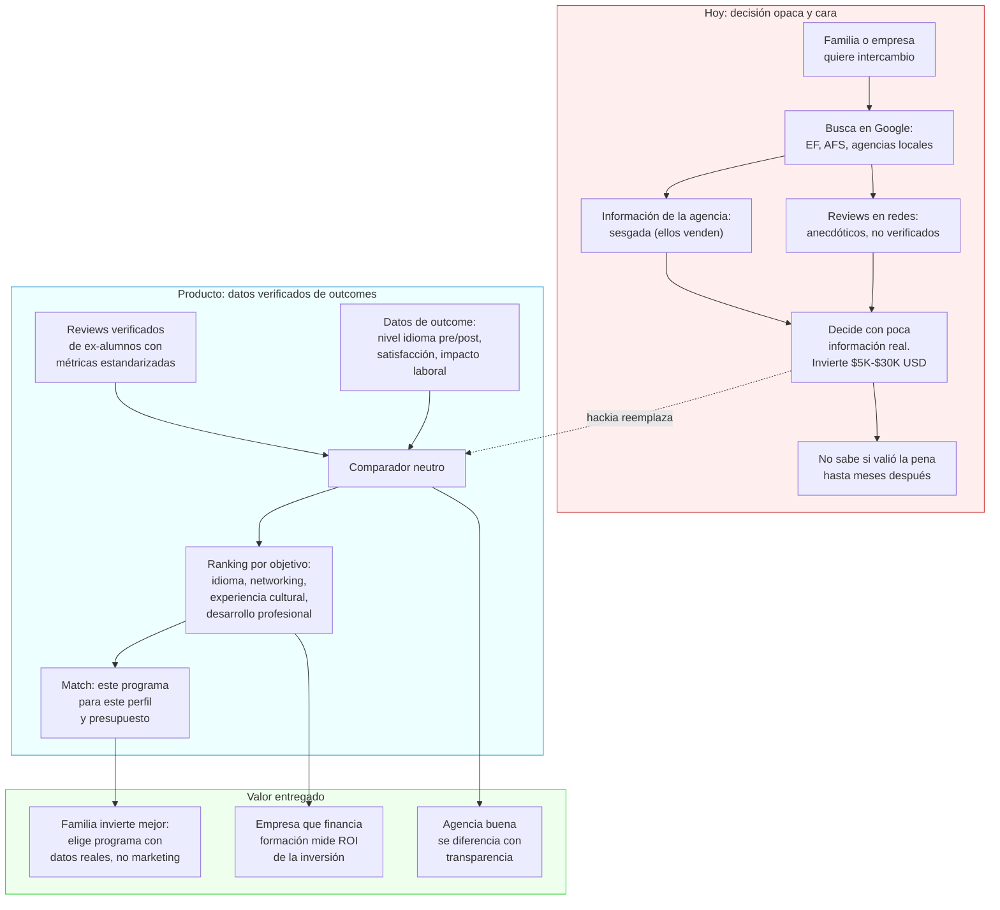
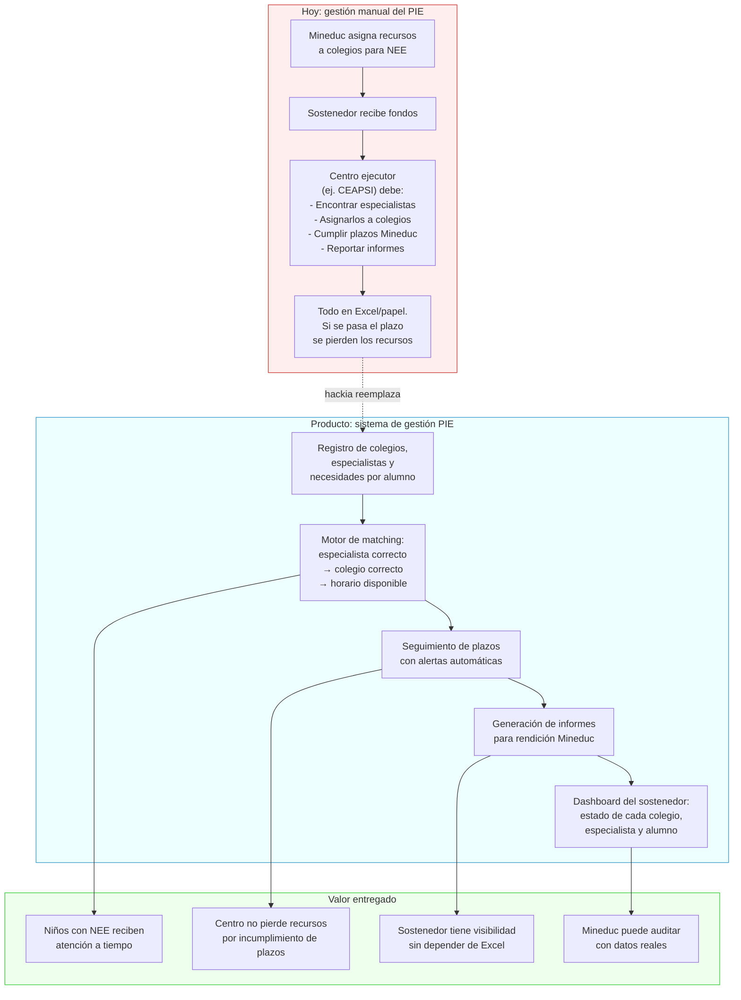
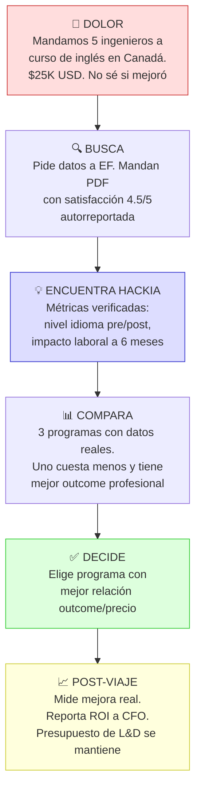
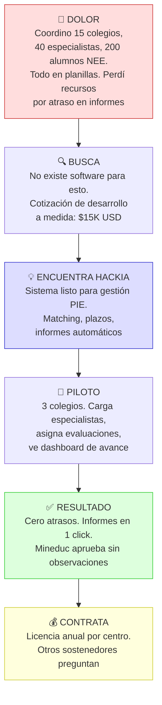

# Travel × Educación: transparencia en programas de intercambio

> Hipótesis central: **Los programas de intercambio y travel educativo son caros y opacos en resultados — nadie mide qué tan buena inversión es realmente.**

Contexto macro: [[espacio-de-oportunidad]] | Research de mercado: [[travel-educacion-research]]

---

## El problema

El mercado de travel educativo (intercambios, cursos en el extranjero, gap years) enfrenta:
- Precios altos con poca transparencia sobre qué incluye realmente
- Sin métricas de outcome: ¿valió la pena el intercambio? ¿mejoró el inglés? ¿consiguió trabajo al volver?
- Información fragmentada y dependiente de reviews subjetivos
- Las instituciones tienen incentivos para no medir resultados negativos

---

## Ideas semilla

- **Plataforma de transparencia para programas de intercambio** — reviews verificados por ex-alumnos con métricas de outcome (nivel de idioma pre/post, satisfacción, impacto laboral)
- **Comparador de programas educativos en el extranjero con datos reales** — precio real vs. valor percibido, ranking por objetivo (idioma, networking, experiencia cultural)
- **HR + educación**: las empresas que pagan intercambios o cursos para empleados necesitan medir el retorno de esa inversión

---

## Conexión con otros temas

- El ángulo corporativo es relevante: algunas empresas incluyen programas educativos en el extranjero como beneficio → conecta con [[2026-02-19-viajes-corporativos-datos]]
- El perfil de nómada digital frecuentemente combina trabajo y formación continua → conecta con [[2026-02-19-nomadas-digitales]]

---

## Flujo de valor — Variante A: Transparencia en intercambios

## Flujo de valor — Variante B: Digitalización del PIE

## Customer journey — Variante A: Gerente de L&D en empresa mediana

## Customer journey — Variante B: Director de centro ejecutor PIE

---

## Preguntas a validar

1. ¿Existe regulación en LATAM sobre transparencia en programas de intercambio?
2. ¿Hay suficiente volumen en LATAM para un negocio de este nicho?
3. ¿El modelo de negocio sería B2C (familias/estudiantes) o B2B (empresas que financian formación)?

---

## Nota de prioridad

Esta hipótesis tiene prioridad **baja** — el mercado es más fragmentado y el ángulo corporativo es menos directo que en [[2026-02-19-viajes-corporativos-datos]]. Vale la pena tenerla capturada pero no es el foco inicial.

---

## Próximos pasos

- [ ] Investigar tamaño del mercado de intercambios educativos en LATAM
- [ ] Identificar jugadores actuales (EF, AFS, programas universitarios propios)
- [ ] Evaluar si el dolor es suficientemente grande para justificar construcción
