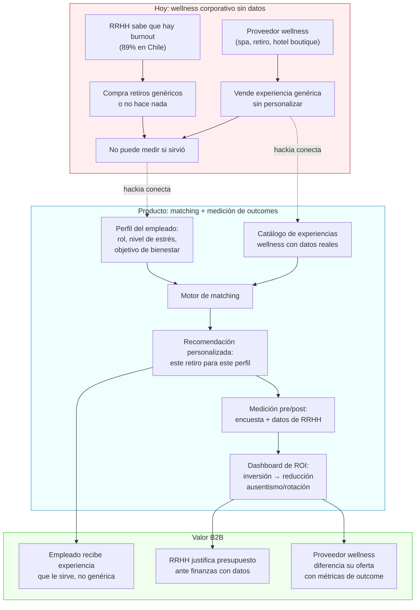
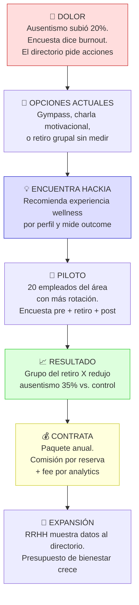

# Travel × Wellness: capa de datos en turismo de bienestar

> Hipótesis central: **El turismo de bienestar crece 2x más rápido que el turismo general pero no hay una capa de datos que lo haga inteligente.**

Contexto macro: [[espacio-de-oportunidad]] | Research de mercado: [[travel-wellness-research]]

---

## El problema

El mercado de wellness travel es enorme y en crecimiento acelerado, pero:
- El matching entre perfil del viajero y tipo de experiencia es artesanal (recomendaciones genéricas)
- Los proveedores no tienen datos sobre outcomes reales de sus huéspedes
- Las empresas no pueden justificar inversión en wellness travel sin datos de impacto

---

## Ideas semilla

- **Matching entre traveler profile y tipo de experiencia wellness** — no todos los retiros de yoga son iguales; el algoritmo debería recomendar basado en objetivo (estrés, burnout, pérdida de peso, espiritualidad) y perfil del viajero
- **Métricas de bienestar pre/post viaje para justificar inversión corporativa** — si una empresa paga un retiro de wellness para su equipo, ¿cómo mide el ROI en productividad y reducción de burnout?

---

## Conexión con el ángulo corporativo

Este segmento tiene un puente directo con [[2026-02-19-viajes-corporativos-datos]]:
- Las empresas están invirtiendo más en bienestar de empleados
- Un viaje de wellness grupal es un beneficio diferencial que RRHH puede medir
- El ROI de wellness travel es el argumento de venta para el buyer corporativo

---

## Flujo de valor

## Customer journey: Gerenta de RRHH — empresa de 300 empleados

---

## Preguntas a validar

1. ¿Hay empresas que ya incluyen wellness travel en sus paquetes de beneficios?
2. ¿Los proveedores de wellness (spas, retiros, hoteles boutique) tienen datos sobre outcomes?
3. ¿El segmento B2C de wellness travel es suficientemente grande para ser negocio sin el corporativo?

---

## Próximos pasos

- [ ] Edgar: mapear qué proveedores de wellness travel existen en LATAM y qué datos manejan
- [ ] Buscar si hay estudios sobre ROI de wellness travel en contexto corporativo
- [ ] Evaluar si el ángulo B2B2C (empresa → empleado → proveedor de wellness) es viable
