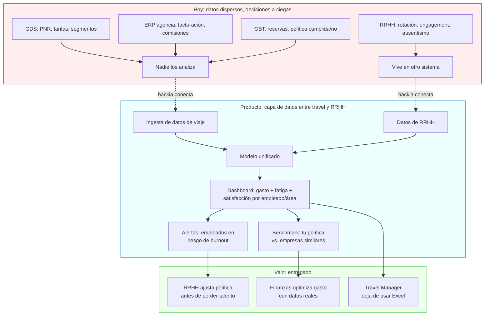
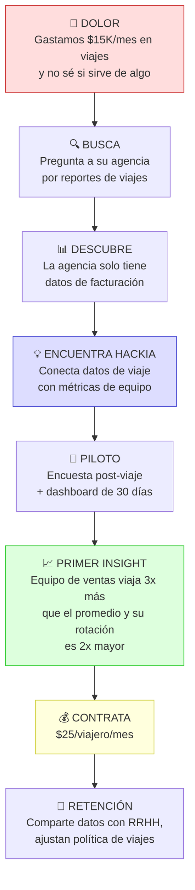

# Travel × Corporativo: dashboard de bienestar en viajes de negocios

> Hipótesis central: **Las empresas no saben si sus políticas de viaje retienen o desgastan talento.**

Contexto macro: [[espacio-de-oportunidad]] | Research de mercado: [[viajes-corporativos-datos-research]]

---

## El problema

Las empresas gastan en viajes de negocios sin medir el impacto humano:
- ¿El empleado que viaja mucho es más productivo o más propenso a renunciar?
- ¿Qué tipo de experiencia de viaje maximiza la satisfacción sin inflar el presupuesto?
- ¿Cómo justifica RRHH ante finanzas que el policy de viajes es competitivo?

Los sistemas actuales (SAP Concur, Navan/TripActions) miden **gasto**, no **bienestar**.

---

## Ideas semilla

- **Dashboard de bienestar en viajes de negocios** — fatiga acumulada, satisfacción post-viaje, productividad correlacionada con tipo de viaje
- **Beneficio de viaje de ocio como perk medible** — ROI en retención: ¿vale más un voucher de $500 en vacaciones que un bono en efectivo?
- **Optimizador de política de viajes con datos reales** — comparar políticas de empresas similares y sugerir ajustes basados en outcomes de retención

---

## Flujo de valor

## Customer journey: Gerente de Administración — empresa mediana, Chile, 200 empleados

---

## Preguntas a validar

1. ¿Existe algún sistema hoy que conecte datos de viaje con datos de RRHH (engagement, rotación)?
2. ¿Los equipos de Travel Management en empresas medianas tienen acceso a datos de satisfacción?
3. ¿Estaría RRHH dispuesto a pagar por este insight o solo IT/Finanzas?

---

## Ventaja del equipo

- **Jose** conoce cómo se toman decisiones de gasto en corporativos grandes — sabe quién es el buyer real
- **Edgar** conoce qué datos existen del lado de los proveedores de travel (hoteles, aerolíneas, OTAs)

---

## Próximos pasos

- [ ] Jose: mapear los pain points reales de su empresa con viajes corporativos
- [ ] Identificar si algún competidor ya resuelve esto (y por qué no ha escalado)
- [ ] Definir el MVP mínimo: ¿encuesta post-viaje + dashboard básico?
