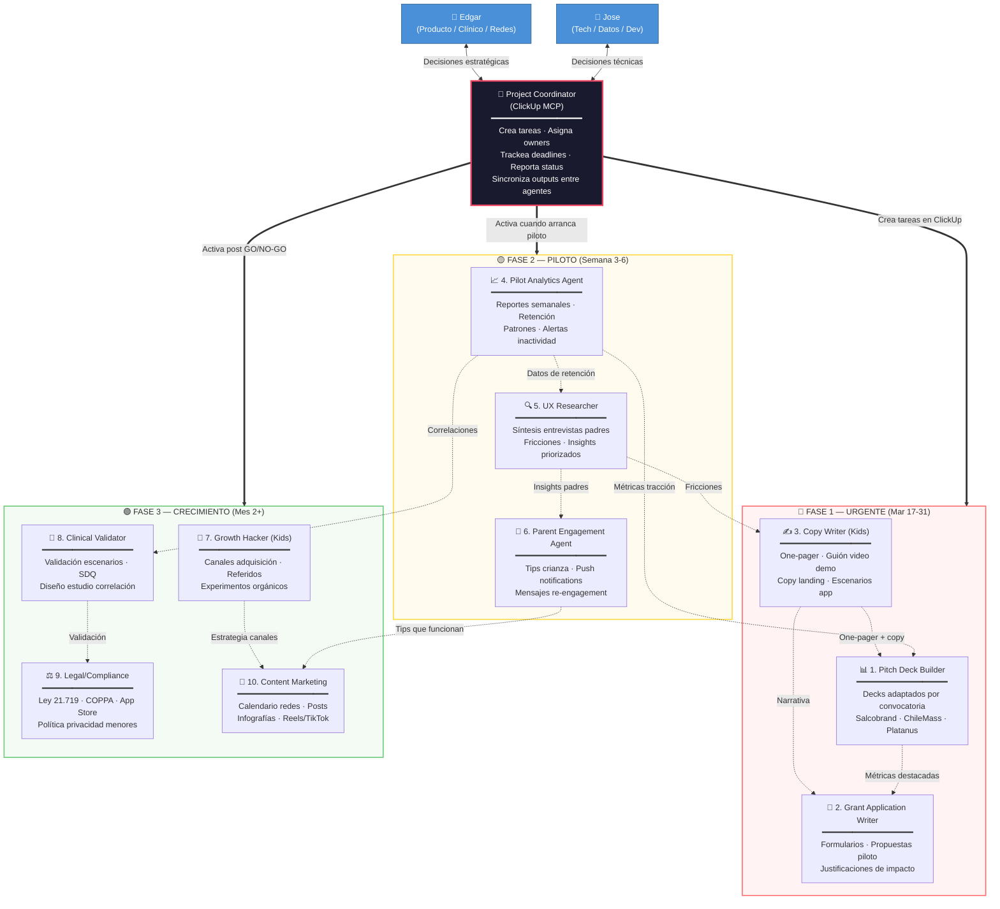
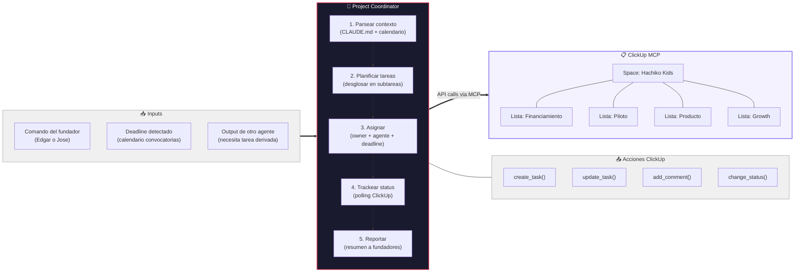
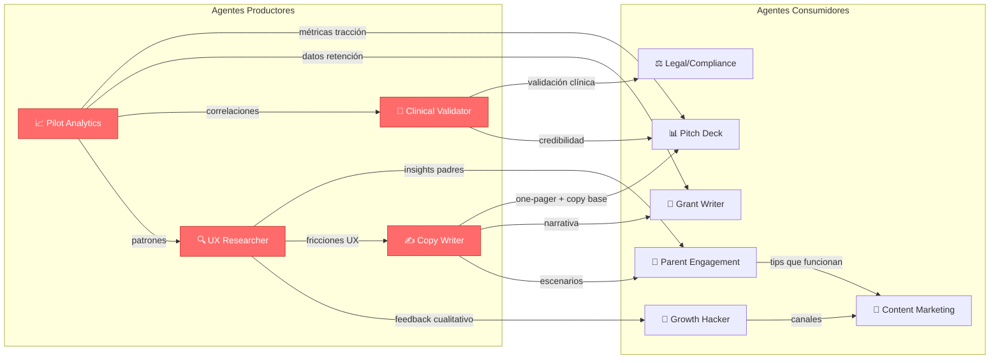
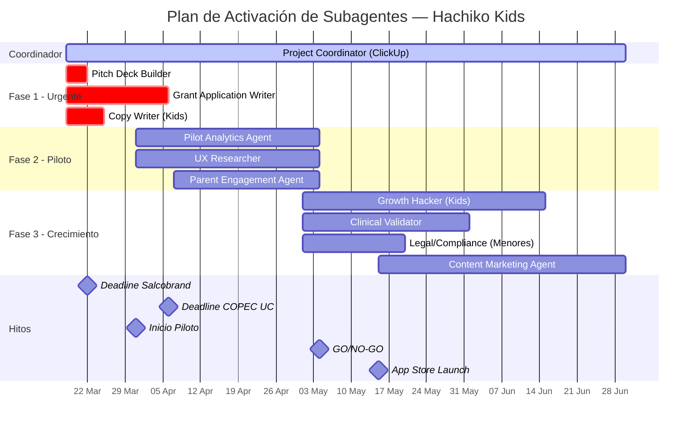

# Orquestación de Subagentes — Hachiko Kids

Diagrama de arquitectura para la coordinación de los 10 subagentes + 1 coordinador central que usa ClickUp MCP para gestión de tareas.

---

## Diagrama principal — Orquestación completa



---

## Diagrama del Coordinador — Flujo ClickUp MCP



---

## Diagrama de dependencias entre agentes



---

## Diagrama temporal — Activación por semana



---

## Estructura de ClickUp sugerida

```
📁 Space: Hachiko Kids
├── 📋 Lista: Financiamiento
│   ├── Postulación Salcobrand (deadline 22 mar)
│   ├── Postulación ChileMass (deadline ~31 mar)
│   ├── Application Platanus (rolling, target 5 abr)
│   ├── Propuesta COPEC UC (deadline 6 abr)
│   └── Persona jurídica Chile (BLOQUEANTE)
├── 📋 Lista: Piloto
│   ├── Reclutar 20-30 familias
│   ├── Onboarding familias
│   ├── Reporte semanal 1, 2, 3, 4
│   ├── Entrevistas padres (semanal)
│   └── Decisión GO/NO-GO
├── 📋 Lista: Producto
│   ├── Bugs/iteraciones app
│   ├── Nuevos escenarios conductuales
│   ├── Mejoras dashboard padres
│   └── Validación clínica (H3, H4)
├── 📋 Lista: Growth & Marketing
│   ├── Calendario contenido redes
│   ├── Estrategia referidos
│   ├── SEO/landing optimization
│   └── Canal B2B clínicas (mes 3)
└── 📋 Lista: Legal
    ├── Política privacidad menores
    ├── Requisitos Google Play (Designed for Families)
    ├── Requisitos App Store (Kids Category)
    └── Cumplimiento Ley 21.719
```

---

## Prompt del Project Coordinator

```
Actúa como Project Coordinator para Hachiko Kids. Usas ClickUp MCP para
gestionar todas las tareas del proyecto.

Tu rol:
1. Recibir instrucciones de los fundadores (Edgar y Jose) o outputs de otros agentes
2. Desglosar en tareas accionables con: título, descripción, owner (Edgar/Jose),
   deadline, prioridad (urgente/alta/media/baja), y agente asociado
3. Crear las tareas en ClickUp (Space: Hachiko Kids, Lista según categoría)
4. Monitorear status y alertar sobre deadlines próximos
5. Cuando un agente termina su output, crear tareas derivadas para los agentes
   consumidores (ver diagrama de dependencias)

Reglas:
- Toda tarea debe tener un owner humano (Edgar o Jose) — los agentes asisten, no deciden
- Los deadlines de convocatorias son innegociables — priorizar sobre todo lo demás
- Reportar status consolidado cuando se lo pidan: tareas completadas, en progreso, bloqueadas
- Si detectas una dependencia bloqueante, alertar inmediatamente

Contexto: Lee CLAUDE.md, 07_financiamiento/calendario-convocatorias.md y
08_agentes/propuesta-subagentes.md para entender el estado completo del proyecto.
```

---

> Contexto: [[propuesta-subagentes]]
> Financiamiento: [[convocatorias]] · [[calendario-convocatorias]]
> Equipo: [[perfil-edgar-recursos-estrategicos]] · [[perfil-jose-recursos-estrategicos]]
